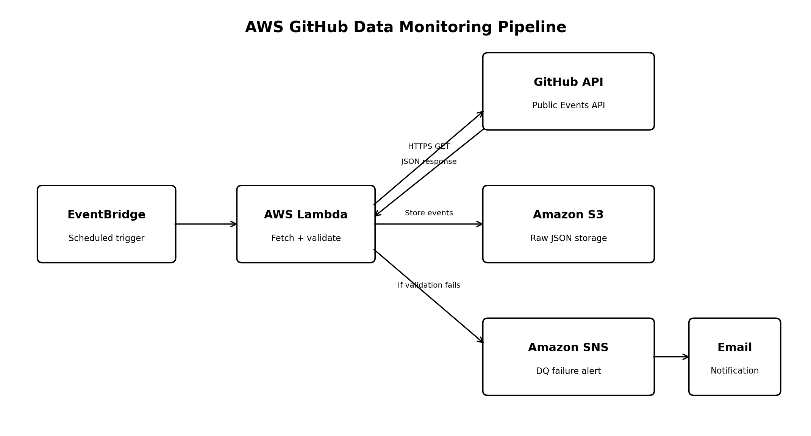

# AWS GitHub Data Monitoring

A serverless data monitoring pipeline built on AWS that retrieves recent public GitHub activity, stores the raw API response, performs basic data-quality validation, and sends an email alert when validation fails.



## Architecture

**EventBridge Scheduler → AWS Lambda → GitHub Public Events API**

Lambda then:
- stores the raw JSON response in **Amazon S3**
- performs event-volume and required-field checks
- publishes an alert to **Amazon SNS** when validation fails
- uses **CloudWatch Logs** for execution monitoring and troubleshooting

## AWS Services

- Amazon EventBridge Scheduler
- AWS Lambda
- Amazon S3
- Amazon SNS
- Amazon CloudWatch
- AWS IAM

## Data Source

The pipeline calls the GitHub Public Events API:

`https://api.github.com/events`

The endpoint provides recent public GitHub activity. This project treats the response as a scheduled snapshot of recent activity rather than a historical date-range dataset.

## Data Quality Checks

The Lambda function currently validates:

1. **Event volume** — raises an alert when fewer than 10 events are returned.
2. **Schema sanity** — checks each event for `id`, `type`, and `created_at`.

The checks can be extended to include freshness, null-value, duplicate, and anomaly detection.

## Data Storage

Each execution stores the raw response using a timestamped S3 object key:

```text
s3://<bucket-name>/raw/github_events_YYYYMMDDTHHMMSSZ.json
```

This provides a simple history of API responses for troubleshooting and analysis.

## Alerting

If a data-quality check fails, Lambda publishes a message to an SNS topic. An email subscription can then deliver the alert to the project owner.

The notification includes:
- execution time
- event count
- validation issue(s)
- S3 location of the raw data

## Environment Variables

Configure these variables in the Lambda function:

| Variable | Description |
| --- | --- |
| `BUCKET` | S3 bucket name used for raw event storage |
| `SNS_TOPIC_ARN` | ARN of the SNS topic used for alerts |

Do not commit AWS credentials or other secrets to this repository.

## Deployment

1. Create an S3 bucket for raw GitHub event data.
2. Create an SNS topic and confirm an email subscription.
3. Create a Python AWS Lambda function.
4. Add `BUCKET` and `SNS_TOPIC_ARN` as Lambda environment variables.
5. Give the Lambda execution role permission to write to the S3 bucket, publish to the SNS topic, and write CloudWatch logs.
6. Copy `lambda_function.py` into the Lambda function and deploy it.
7. Test the Lambda function manually.
8. Create an EventBridge Scheduler schedule and configure the Lambda function as its target.
9. Verify executions in CloudWatch and confirm new JSON objects appear in S3.

## Repository Structure

```text
aws-github-data-monitoring/
├── README.md
├── lambda_function.py
├── .gitignore
├── architecture/
│   └── architecture-diagram.png
└── sample-data/
    └── sample_github_events.json
```

## Sample Data

`sample-data/sample_github_events.json` contains synthetic example records that demonstrate the structure without publishing production data or account information.

## Skills Demonstrated

Serverless AWS architecture, REST API ingestion, Python, scheduled data pipelines, S3 data storage, automated data-quality validation, SNS alerting, IAM permissions, and CloudWatch monitoring.

## Future Improvements

- Add data-freshness and duplicate-event checks
- Store monitoring metrics for trend analysis
- Query historical S3 data with Amazon Athena
- Add retries and dead-letter handling
- Provision infrastructure with Terraform or AWS CDK
- Add automated tests and CI/CD
